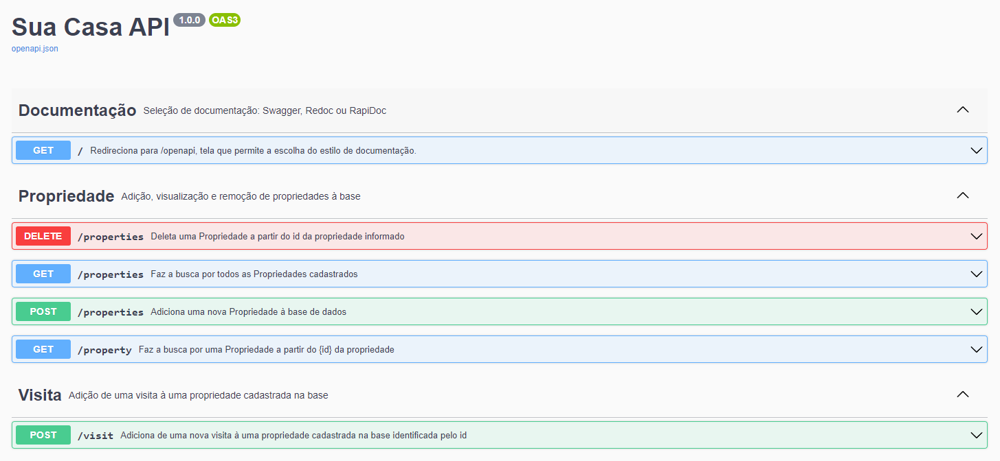

# API - SUA CASA

A **API - Sua Casa** fornece serviços para imobiliarias, facilitando o contato com o cliente.

Principais funcionalidades:
- **Cadastro de propriedade**: cadastro de propriedades;
- **Exclusão de uma propriedade**: exclusão de determinada propriedade atráves de se ID;
- **Listagem de propriedades**: traz todas as propriedades cadastradas;
- **Cadastro de visitas**: marcação de visita para uma determinada propriedade;
- **Listagem das visitas**: lista as visitas de cada propriedade.

---
## Implementação das funcionaidades
- [x] Cadastro de propriedade;
- [x] Exclusão de uma propriedade;
- [x] Listagem de propriedades;
- [x] Cadastro de visitas;
- [x] Listagem das visitas;
- [ ] Exclusão de uma visita;
- [ ] Autenticação;
- [ ] Fluxo de Compra e Venda.

---
## Tecnologias e Arquitetura
- **Flask**: micro-framework python;
- **SQLite3**: banco de dados;
- **MVC**: modelo arquitetural amplamente utilizado e de fácil implementação;
- **Documentação**: atráves da lib `flask-openapi3` temos aqui uma rica documentação, podende ser: Swagger, ReDoc ou RapiDoc.

---
## Execução da Api

flask run --host 0.0.0.0 --port 5000 --reload